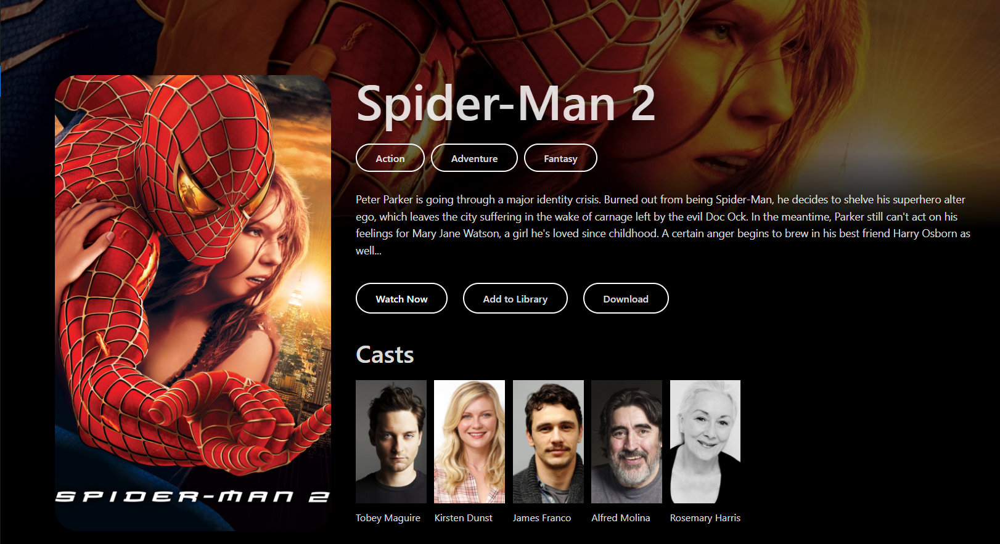
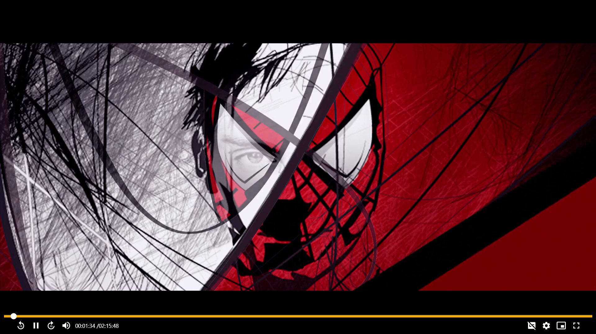
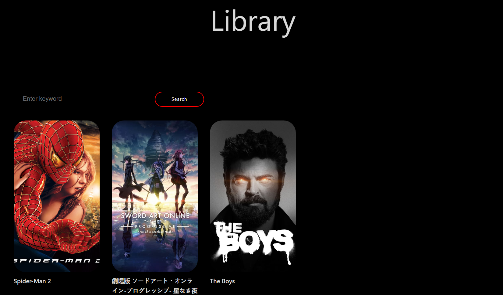

# 🎬 Storrflix (previously MMDM)

Storrflix is a decentralized media streaming platform inspired by the **UI/UX of OTT giants like Netflix** — but with a radical difference: instead of centralized media servers, it leverages the **global torrent swarm** to fetch and stream movies & TV shows in real-time.

It supports **Matroska subtitles**, integrates with multiple APIs (TMDB, RARBG, YTS, etc.), and even includes a **serverless "Watch Together" mode** via WebRTC links.

- 🏆 [Devpost article — Winner at Samhita 2023 Hackathon](https://devpost.com/software/storrflix)
- 📄 [Research Paper (PDF)](./docs/storrflix-paper.pdf)

---

## 📺 Project Demo - Youtube (Click on the image)

---

✨ **At a glance**:  
Storrflix brings the familiar, sleek experience of Netflix but **decentralized**, allowing users to stream content directly from torrent swarms, with no central servers, no bottlenecks, and full peer-to-peer scalability.

---

## 🌟 Highlights

- 🎥 **Netflix-like UI** built with React & Electron.js
- 🌍 **Decentralized streaming** via torrent swarms
- ⏯ **Matroska subtitle support** out of the box
- 🔌 **Multiple API integrations** (TMDB, RARBG, YTS, and more)
- 🕸 **Serverless "Watch Together" mode** using WebRTC peer links
- 📡 Uses WebTorrent for browser & desktop streaming

---

## 🛠 Tech Stack

- ⚛️ React (frontend)
- 🖥 Electron.js (desktop app shell)
- 🌐 Node.js backend (torrent engine)
- 🌊 WebTorrent (peer-to-peer streaming)
- 🎨 SCSS (styling)

---

## 🖼 Screenshots

Each screenshot is displayed at full container width. Click to view in full size.

### Movie Details

  <figure style="width:100%;margin:0">
    
    <figcaption style="font-size:0.95em;margin-top:6px">`movie-details.png` — Movie info & streaming sources</figcaption>
  </figure>

### Video Player

  <figure style="width:100%;margin:0">
    
    <figcaption style="font-size:0.95em;margin-top:6px">`video-player.png` — Video Player with settings and options to enable Closed Captions</figcaption>
  </figure>

### Watch Together - Youtube (Click on the image)

### Library

  <figure style="width:100%;margin:0">
    
    <figcaption style="font-size:0.95em;margin-top:6px">`library.png` — Library Page</figcaption>
  </figure>

---

## ⚡️ Prerequisites

- Node.js (16+)
- npm or pnpm
- Electron.js toolchain

---

## 🛣 Roadmap

- 🔧 Optimize torrent fetching & caching
- 🎛 Enhance "Watch Together" features (sync subtitles, chat)
- 📱 Explore mobile clients (React Native + WebRTC)
- 📡 Add support for more torrent indexers & APIs

---

## 📝 Footnote

This project **started as a proof of concept** to explore the use of **private decentralized torrent trackers as an alternative to global CDNs** for streaming.
It was inspired by the surge in **server load and bandwidth strain during the COVID-19 era**, where decentralized solutions offered a resilient, scalable alternative.
